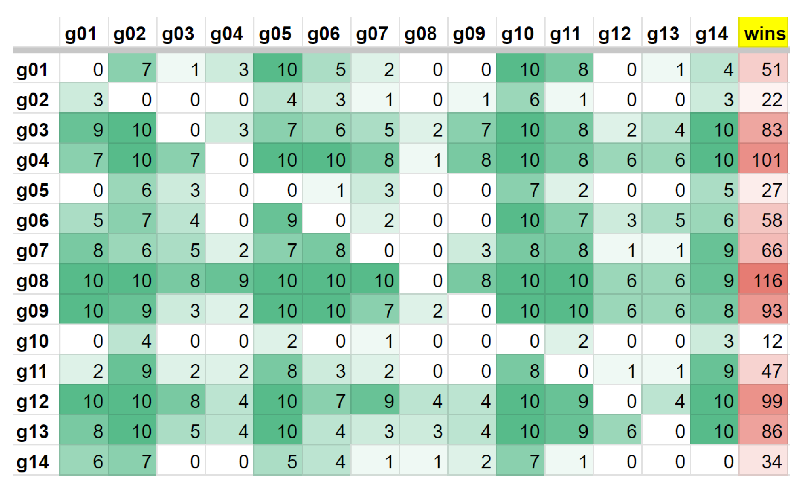

# Battlesnake-Duel

This is a Python program for Duel Battle Snake.

You should follow this link to build your battlesnake on Replit and replace the code in main.py with this code.

[starter-snake-python repository](https://github.com/BattlesnakeOfficial/starter-snake-python)

If you download the file on replit to your PC. You can run it by the command below. But you should set your port to 8000 and 8001 first, then run the main.py and main2.py(or something else, just don't run the same file on two port.)

    battlesnake play --url http://0.0.0.0:8000 --name Snake1 --url http://0.0.0.0:8001 --name Snake2 -W 11 -H 11 -g standard --browser

## Duel Rules

1. 1 vs 1 (You can change code in train.py to make it better at facing different number of enemies)
2. 11×11 board
3. Start with 100 health, decreasing by 1 with each move. Health regenerates to 100 when your snake eats food.
4. Decisions must be made within 500 milliseconds.

## Why I Created This

In my college's PBL (Problem-Based Learning) class, we were tasked with creating a group Battle Snake program. Thanks to Cory Binnersley's post on Medium, I make my mind to make a Reinforcement Learning battlesnake. Sadly, I don't have much time so my code in main.py only check whether the move won't suicide.

If you are interested in how the snake work and some introduce about it. Please visit the [article](https://medium.com/asymptoticlabs/battlesnake-post-mortem-a5917f9a3428) by Cory Binnersley. Thanks to him, most of train.py's code is from their [example notebook](https://colab.research.google.com/drive/19Rz916XaYRlq9sOgi8VtXdHgOMkysw2M?usp=sharing).

You can have a trial by using their notebook in Google Colab. Or use starter pack and replace main.py as mine. And put all the file into the pack.

If you want to train your model by yourself, please note that in gym_battlesnake/src/gameinstance.cpp, from line 96, the logic of up and down is written in a wrong way. You can fix it and use 0 as up and 1 as down in main.py. Or dismiss it and use my main.py without changes.

## Strategy

When training, I set opponent as one. And update the model's state when the win rate against both the previous best model and random choose of recently five best model are more then 53%. The reason of 53% is that

$$ SE = 1.96 \sqrt{\frac{0.5 \times 0.5}{1000}} =0.03099... $$

So the win rate should be more then $50\% + 3.099\% \approx 53\%$.

But I am not sure I can use this formula in this case. Because the win rate is not(or may not be) a normal distribution. So I just use it as a reference.

## Spec

CPU: Intel i5-13600k  
GPU: RTX 3090

## Train

I use gpu to train the model. And cpu to play the game.
The total times of training is about 2 billion times. This takes about 4 total days on a 3090.

## Result

As a result, my group (g08) was able to win the competition in class. By the way, most of the teams use Monte Carlo Tree Search.

